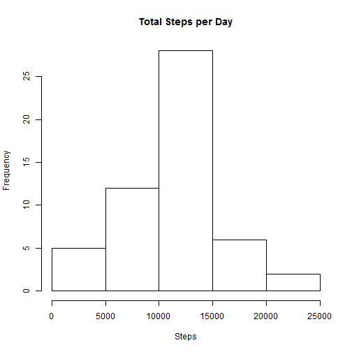
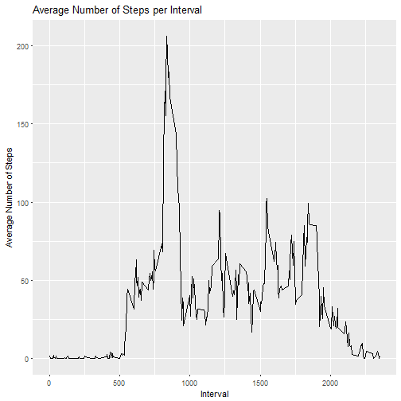
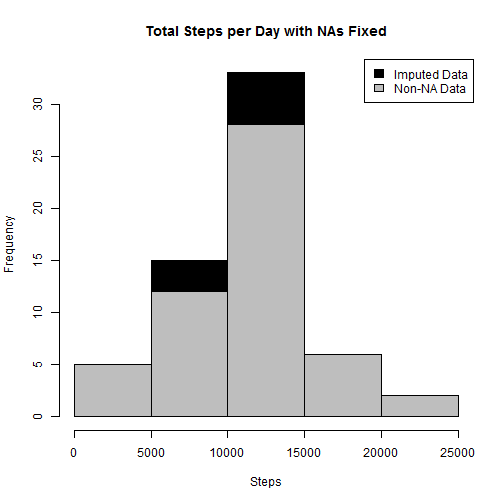
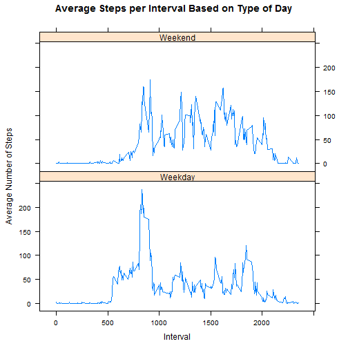

# Reproducible Research Project 1

## Including relevant packages

```r
library(base)
library(ggplot2)
library(plyr)
library(lattice)
```

## Q1-Load the data (i.e. read.csv())

```r
if(!file.exists('activity.csv')){
    unzip('activity.zip')
}
activity <- read.csv('activity.csv')
```
##----------------------------------------------------------------------------------------
## Q2-Process/transform the data (if necessary) into a format suitable for your analysis

```r
activity$day <- weekdays(as.Date(activity$date))
activity$DateTime<- as.POSIXct(activity$date, format="%Y-%m-%d")

##pulling data without nas
clean <- activity[!is.na(activity$steps),]
```
#-----------------------------------------------------------------------------------------
## Q3 What is mean total number of steps taken per day?

## Q3.1-Calculate the total number of steps taken per day

```r
sumTable <- aggregate(activity$steps ~ activity$date, FUN=sum, )
colnames(sumTable)<- c("Date", "Steps")
```
## Q3.2-Make a histogram of the total number of steps taken each day

```r
hist(sumTable$Steps, breaks=5, xlab="Steps", main = "Total Steps per Day")
```



## Q3.3-Calculate and report the mean and median of the total number of steps taken per day

```r
##Mean of steps
as.integer(mean(sumTable$Steps))
```

```
## [1] 10766
```

```r
##Median of steps
as.integer(median(sumTable$Steps))
```

```
## [1] 10765
```
##----------------------------------------------------------------------------------------
## Q4-What is the average daily activity pattern?

## Q4.1- Make a time series plot (i.e. type = "l") of the 5-minute interval (x-axis) and the average number of steps taken, averaged across all days (y-axis)

```r
##pulling data without nas
clean <- activity[!is.na(activity$steps),]

##create average number of steps per interval
intervalTable <- ddply(clean, .(interval), summarize, Avg = mean(steps))

##Create line plot of average number of steps per interval
p <- ggplot(intervalTable, aes(x=interval, y=Avg), xlab = "Interval", ylab="Average Number of Steps")
p + geom_line()+xlab("Interval")+ylab("Average Number of Steps")+ggtitle("Average Number of Steps per Interval")
```



## Q4.2-Which 5-minute interval, on average across all the days in the dataset, contains the maximum number of steps?

```r
##Maximum steps by interval
maxSteps <- max(intervalTable$Avg)
##Which interval contains the maximum average number of steps
intervalTable[intervalTable$Avg==maxSteps,1]
```

```
## [1] 835
```
##----------------------------------------------------------------------------------------
## Q5-Imputing missing values

## Q5.1- Calculate and report the total number of missing values in the dataset (i.e. the total number of rows with NAs)

```r
nrow(activity[is.na(activity$steps),])
```

```
## [1] 2304
```

## Q5.2-Devise a strategy for filling in all of the missing values in the dataset. The strategy does not need to be sophisticated. For example, you could use the mean/median for that day, or the mean for that 5-minute interval, etc.

```r
##The strategy for filling in NAs will be to substitute the missing steps with the average 5-minute interval based on the day of the week.

## Create the average number of steps per weekday and interval
avgTable <- ddply(clean, .(interval, day), summarize, Avg = mean(steps))

## Create dataset with all NAs for substitution
nadata<- activity[is.na(activity$steps),]

## Merge NA data with average weekday interval for substitution
newdata<-merge(nadata, avgTable, by=c("interval", "day"))
```

##Q5.3-Create a new dataset that is equal to the original dataset but with the missing data filled in

```r
## Reorder the new substituded data in the same format as clean data set
newdata2<- newdata[,c(6,4,1,2,5)]
colnames(newdata2)<- c("steps", "date", "interval", "day", "DateTime")

##Merge the NA averages and non NA data together
mergeData <- rbind(clean, newdata2)
```

##Q5.4-Make a histogram of the total number of steps taken each day and Calculate and report the mean and median total number of steps taken per day. Do these values differ from the estimates from the first part of the assignment? What is the impact of imputing missing data on the estimates of the total daily number of steps?

```r
##Create sum of steps per date to compare with step 1
sumTable2 <- aggregate(mergeData$steps ~ mergeData$date, FUN=sum, )
colnames(sumTable2)<- c("Date", "Steps")

## Mean of Steps with NA data taken care of
as.integer(mean(sumTable2$Steps))
```

```
## [1] 10821
```

```r
## Creating the histogram of total steps per day, categorized by data set to show impact
hist(sumTable2$Steps, breaks=5, xlab="Steps", main = "Total Steps per Day with NAs Fixed", col="Black")
hist(sumTable$Steps, breaks=5, xlab="Steps", main = "Total Steps per Day with NAs Fixed", col="Grey", add=T)
legend("topright", c("Imputed Data", "Non-NA Data"), fill=c("black", "grey") )
```



##The new mean of the imputed data is 10821 steps compared to the old mean of 10766 steps. That creates a difference of 55 steps on average per day.

##The new median of the imputed data is 11015 steps compared to the old median of 10765 steps. That creates a difference of 250 steps for the median.

##However, the overall shape of the distribution has not changed.
##----------------------------------------------------------------------------------------
##Q6-Are there differences in activity patterns between weekdays and weekends?

##Q6.1-Create a new factor variable in the dataset with two levels - "weekday" and "weekend" indicating whether a given date is a weekday or weekend day.

```r
## Create new category based on the days of the week
mergeData$DayCategory <- ifelse(mergeData$day %in% c("Saturday", "Sunday"), "Weekend", "Weekday")
```

##Q6.2-Make a panel plot containing a time series plot (i.e. type = "l") of the 5-minute interval (x-axis) and the average number of steps taken, averaged across all weekday days or weekend days (y-axis). See the README file in the GitHub repository to see an example of what this plot should look like using simulated data.

```r
## Summarize data by interval and type of day
intervalTable2 <- ddply(mergeData, .(interval, DayCategory), summarize, Avg = mean(steps))

##Plot data in a panel plot
xyplot(Avg~interval|DayCategory, data=intervalTable2, type="l",  layout = c(1,2),
       main="Average Steps per Interval Based on Type of Day", 
       ylab="Average Number of Steps", xlab="Interval")
```



##Yes, the step activity trends are different based on whether the day occurs on a weekend or not. This may be due to people having an increased opportunity for activity beyond normal work hours for those who work during the week.
